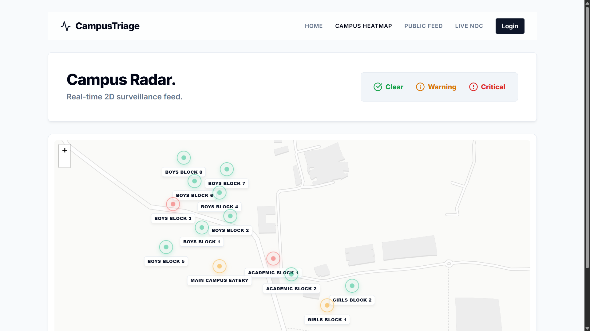
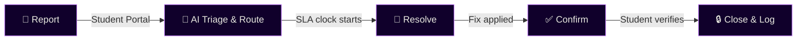

<div align="center">


<br/>

[](https://git.io/typing-svg)

<a href="https://tech-tinkerers-swastik.vercel.app/">
  
</a>

</div>


## 🎯 About the Project

**CampusTriage** replaces scattered registers and WhatsApp groups with a unified, transparent ticketing system for campus maintenance. Whether it's a broken fan, leaking pipe, or IT issue, the system provides:

- 🎫 A **unique ticket ID**
- 👤 An **assigned owner**
- ⏱️ A **visible SLA timeline**

Students can report issues by manually selecting locations through a dedicated web portal. The system auto-routes tickets to the correct department using AI triage, starts an SLA clock, and escalates automatically if resolution is delayed. The closed-loop workflow ensures that only the reporting student can confirm a fix, preventing false closures.

All status changes are cryptographically timestamped in a **hash-chained Escalation Ledger**, making the system independently auditable — a first for campus grievance management.

<div align="center">

</div>

## 🔗 Live Demo

<div align="center">

### **[tech-tinkerers-swastik.vercel.app](https://tech-tinkerers-swastik.vercel.app/)**

</div>

## 🖥️ Preview

<div align="center">

<br/><br/>

<br/><br/>

<br/><br/>

</div>


## ✨ Key Features

<div align="center">

| Feature | Description |
|---|---|
| 🏫 **Student Portal** | Students can manually select locations and instantly file complaints. Supports image uploads for visual context. |
| 🧠 **Smart AI Triage (Gemini)** | Automatically analyzes complaint text and images to assign the correct department and priority (LOW to CRITICAL). |
| 🛠️ **Technician Dashboard** | Dedicated view for maintenance staff to see assigned tickets and update resolution status. |
| 🗺️ **Campus Heatmap** | Interactive Leaflet-based map visualizing the density and locations of active complaints across campus. |
| 👍 **Public Feed & Upvoting** | A transparent, Reddit-style feed where students can view and upvote common issues. |
| 📊 **Live NOC (Admin Dashboard)** | Real-time monitoring of system SLAs, active tickets, and overall maintenance health. |
| 🔒 **Hash-Chained Audit Logs** | Every ticket update is cryptographically hashed to prevent tampering. |

</div>

## 🔄 Workflow

<div align="center">



</div>

1. **Report** — Web portal with manual location tagging
2. **AI Triage** — Gemini analyzes issue severity and department
3. **Auto-Route** — Ticket is assigned; SLA clock starts
4. **Resolve** — Assigned staff attends & updates status
5. **Confirm** — Student verifies fix & rates the resolution
6. **Close & Log** — Ticket closed; entry sealed in the Escalation Ledger


## 🛠️ Tech Stack

<div align="center">


</div>

<div align="center">

| Layer | Technology |
|---|---|
| **Frontend** | React 19, Vite, Tailwind CSS v4, Framer Motion, React Leaflet |
| **Backend** | Node.js, Express, Prisma ORM |
| **Database** | PostgreSQL |
| **AI/ML** | Google GenAI SDK (Gemini 2.5 Flash) |

</div>

## 📂 Project Structure

<details open>
<summary><b>Current layout in the repository</b></summary>

```
TechTinkerers-Swastik/
├── client/                 # React frontend application
│   ├── src/pages/          # Student Portal, Tech Dashboard, Heatmap, etc.
│   └── src/components/     # UI components
├── server/                 # Node.js backend application
│   ├── src/controllers/    # aiController, etc.
│   ├── src/routes/         # API routes
│   └── prisma/             # Database schema & migrations
└── README.md
```

</details>


## 🚀 Getting Started

### Clone & Install

```bash
git clone https://github.com/swastiksinha1/TechTinkerers-Swastik.git
cd TechTinkerers-Swastik
```

<details open>
<summary><b>⚙️ Server</b></summary>

```bash
cd server
npm install
cp .env.example .env          # configure DATABASE_URL, GEMINI_API_KEY
npx prisma generate
npx prisma db push
npm run dev
```

</details>

<details open>
<summary><b>🖥️ Client</b></summary>

```bash
cd client
npm install
npm run dev
```

</details>

## 📱 Usage

<div align="center">

| Role | What they can do |
|---|---|
| 🎓 **Students** | File complaints, attach media, track status on portal, upvote public feed issues, and confirm resolution to earn Karma. |
| 🛠️ **Technicians** | View assigned tickets in the technician dashboard; update status for resolution. |
| 🏢 **Admins / Wardens**| View the Live NOC dashboard for SLAs and the Campus Heatmap. |

</div>


## 👥 Team — Tech Tinkerers

<div align="center">
<table>
  <tr>
    <td align="center">
      <a href="https://github.com/RishiRaj1495">
        <br/>
        <sub><b>Rishi Raj</b></sub>
      </a>
    </td>
    <td align="center">
      <a href="https://github.com/swastiksinha1">
        <br/>
        <sub><b>Swastik Sinha</b></sub>
      </a>
    </td>
    <td align="center">
      <a href="https://github.com/Abhilash-2210">
        <br/>
        <sub><b>Abhilash Singh</b></sub>
      </a>
    </td>
    <td align="center">
      <a href="https://github.com/ari9516">
        <br/>
        <sub><b>ari9516</b></sub>
      </a>
    </td>
  </tr>
</table>
</div>

## 📄 License

Distributed under the MIT License. See `LICENSE` for more information.

<div align="center">

</div>
