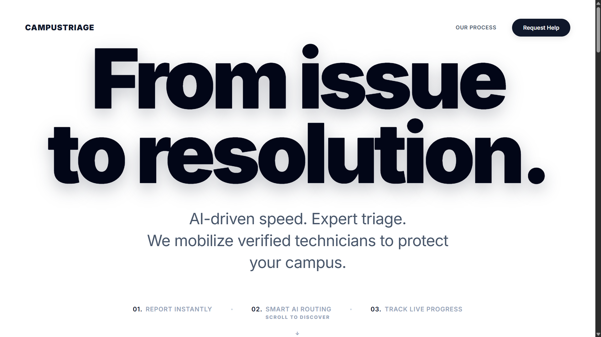
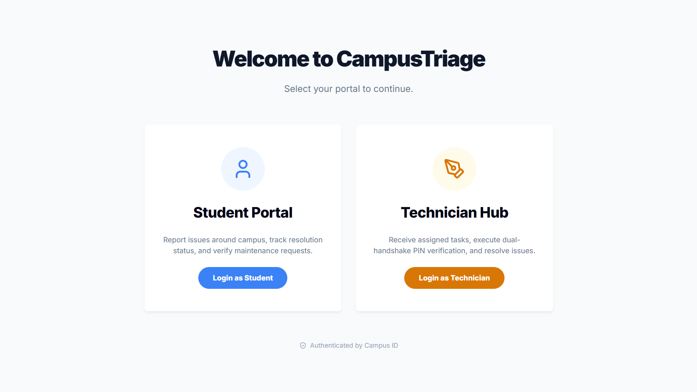
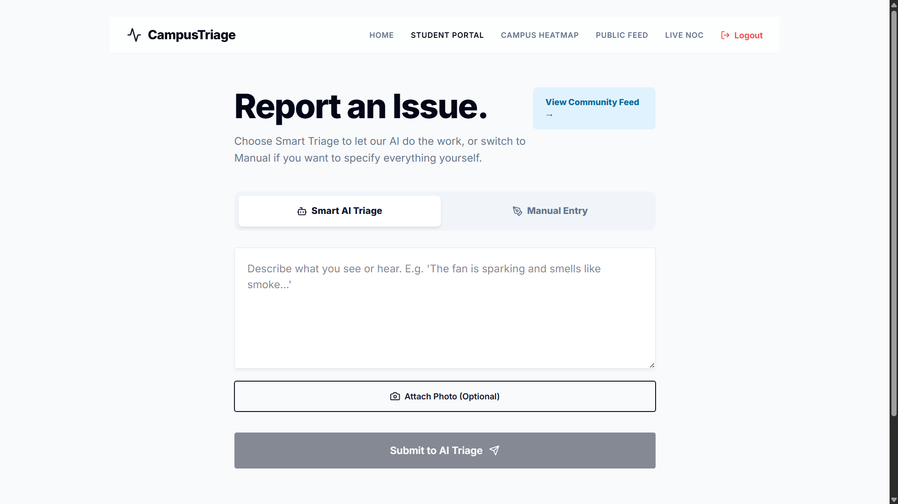
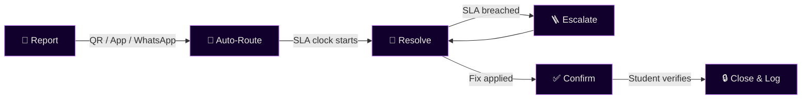

<div align="center">


<br/>

[](https://git.io/typing-svg)

<a href="https://tech-tinkerers-swastik.vercel.app/">
  
</a>

</div>


## 🎯 About the Project

The **Campus Grievance Redressal and Maintenance Tracker** replaces scattered registers, WhatsApp groups, and email chains with a unified, auditable ticketing system. Every complaint — whether a broken fan in a hostel room, a leaking pipe in the mess, or a faulty projector in an academic block — gets:

- 🎫 A **unique ticket ID**
- 👤 An **assigned owner**
- ⏱️ A **visible SLA timeline**

Students can report issues via QR codes placed across 500+ campus points, a dedicated PWA app, or even WhatsApp. The system auto-routes tickets to the correct department, starts an SLA clock, and escalates automatically if resolution is delayed. The closed-loop workflow ensures that only the reporting student can confirm a fix, preventing false closures.

All status changes are cryptographically timestamped in a **hash-chained Escalation Ledger**, making the system independently auditable — a first for campus grievance management.

<div align="center">

</div>

## 🔗 Live Demo

<div align="center">

### **[tech-tinkerers-swastik.vercel.app](https://tech-tinkerers-swastik.vercel.app/)**

</div>

## 🖥️ Preview

<div align="center">

<br/><br/>

<br/><br/>

</div>


## ✨ Key Features

<div align="center">

| Feature | Description |
|---|---|
| 📷 **QR-tag Reporting** | Scan QR codes at 500+ campus locations to file a complaint instantly. |
| 🖼️ **Photo/Video Attachment** | Upload media with automatic severity tagging via AI/ML classifiers. |
| 🧭 **Auto-Routing & SLA** | Location + category matrix routes tickets; SLA clock starts immediately. |
| 🪜 **Escalation Ladder** | Technician → Warden → Dean; auto-escalates if SLA is breached. |
| 🔒 **Tamper-Evident Ledger** | Blockchain-based hash chain timestamps every status change. |
| ✅ **Student Confirmation** | Ticket cannot be closed without the student's verification. |
| 💬 **Multi-Channel Reporting** | PWA, WhatsApp Business API, SMS fallback for low-connectivity areas. |
| 📊 **Analytics Dashboard** | Real-time insights for wardens and the Estate Office. |

</div>

## 🔄 Workflow

<div align="center">



</div>

1. **Report** — QR scan, app, or WhatsApp
2. **Auto-Route** — Category + location matrix; SLA clock starts
3. **Resolve** — Assigned staff attends & updates status
4. **Escalate** — Auto-escalates to next tier if SLA breached
5. **Confirm** — Student verifies fix & rates the resolution
6. **Close & Log** — Ticket closed; entry sealed in the Escalation Ledger


## 🛠️ Tech Stack

<div align="center">


</div>

<div align="center">

| Layer | Technology |
|---|---|
| **Languages** | TypeScript, Python |
| **Frontend** | React.js + Tailwind CSS (Admin Web Portal), Flutter (PWA for hostel Android phones) |
| **Backend** | Node.js + Express (ticket & routing), Django REST Framework (analytics) |
| **AI/ML** | Text classifier + image severity scoring |
| **Database** | PostgreSQL (tickets), Redis (SLA queue) |
| **Blockchain** | Hash-chained Escalation Ledger |
| **Integrations** | QR generation/scanning, Firebase Cloud Messaging, WhatsApp Business API, Twilio |

</div>

## 📂 Project Structure

<details open>
<summary><b>Current layout in the repository</b></summary>

```
TechTinkerers-Swastik/
├── client/                 # Frontend application
├── server/                 # Backend application
└── README.md
```

</details>

<details>
<summary><b>Planned expansion as the project grows</b></summary>

```
campus-grievance-tracker/
├── frontend/
│   ├── admin-web/          # React + Tailwind dashboard
│   └── pwa/                # Flutter PWA
├── backend/
│   ├── ticket-engine/      # Node.js + Express
│   └── analytics/          # Django REST
├── ai-ml/                  # Classifiers & severity models
├── blockchain/             # Escalation Ledger (hash chain)
├── infrastructure/         # Redis, Postgres configs
└── docs/                   # SOPs, wireframes, pilot data
```

</details>


## 🚀 Getting Started

### Clone & Install

```bash
git clone https://github.com/swastiksinha1/TechTinkerers-Swastik.git
cd TechTinkerers-Swastik
```

<details open>
<summary><b>⚙️ Server</b></summary>

```bash
cd server
npm install
cp .env.example .env          # configure DB, Redis, API keys
npm run dev
```

</details>

<details open>
<summary><b>🖥️ Client</b></summary>

```bash
cd client
npm install
npm start
```

</details>

> As additional services (analytics, mobile PWA, blockchain ledger, etc.) are added, their setup steps will be documented here.

## 📱 Usage

<div align="center">

| Role | What they can do |
|---|---|
| 🧑‍🎓 **Students** | Scan QR codes or open the PWA to file complaints, attach media, track status, and confirm resolution. |
| 🛠️ **Staff** | Receive tickets via WhatsApp or the admin dashboard; update status and communicate with students. |
| 🏢 **Wardens/Admins** | Monitor SLAs, view analytics, and escalate issues when needed. |
| 🏛️ **Estate Office** | Access the Escalation Ledger for audit trails and generate reports for NAAC/NBA compliance. |

</div>


## 👥 Team — Tech Tinkerers

<div align="center">
<table>
  <tr>
    <td align="center">
      <a href="https://github.com/RishiRaj1495">
        <br/>
        <sub><b>Rishi Raj</b></sub>
      </a>
    </td>
    <td align="center">
      <a href="https://github.com/swastiksinha1">
        <br/>
        <sub><b>Swastik Sinha</b></sub>
      </a>
    </td>
    <td align="center">
      <a href="https://github.com/Abhilash-2210">
        <br/>
        <sub><b>Abhilash Singh</b></sub>
      </a>
    </td>
    <td align="center">
      <a href="https://github.com/ari9516">
        <br/>
        <sub><b>ari9516</b></sub>
      </a>
    </td>
  </tr>
</table>
</div>

## ⚠️ Risks & Mitigations

<div align="center">

| Risk | Mitigation |
|---|---|
| Departments ignore SLA timers | Leadership enforcement; dashboard transparency; Escalation Ledger makes breaches visible. |
| Students prefer direct messaging over QR/app | Orientation-week push; hostel-committee buy-in; WhatsApp fallback reduces friction. |
| Poor network connectivity | SMS/WhatsApp fallback; lightweight PWA designed for slow Wi-Fi. |
| AI severity misclassifies urgent issues | Allow students to manually flag "urgent," overriding the model's score. |

</div>

## 📄 License

Distributed under the MIT License. See `LICENSE` for more information.

<div align="center">

</div>
